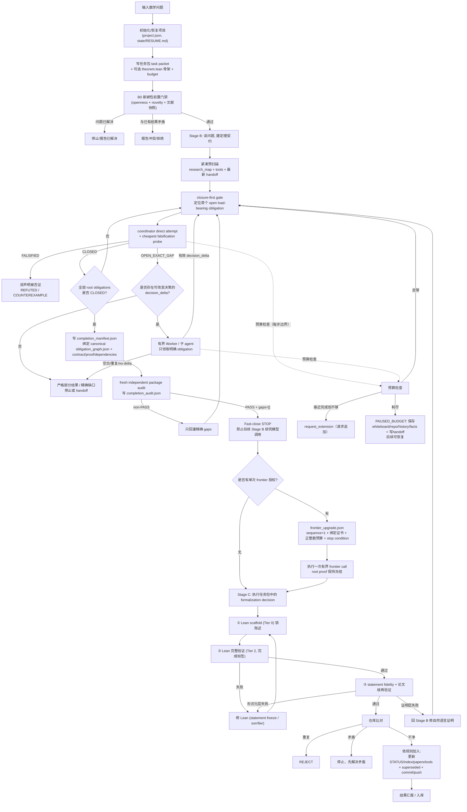

# Pipeline full flow: from a math problem to a verified result

This document describes one full run of the math-research workflow pipeline
(`$math-research-workflow` driving `manage-math-research-program` →
`rigorous-open-math-research` → `lean-verify` → submission audit), including
all major branches and terminal states.

## Overview


## Full flow with branches



## Branch summary

| 位置 | 分支 | 结果 |
| --- | --- | --- |
| B0 新颖性 | 已解决 / 矛盾 / 通过 | 停止 / 拒绝 / 继续 |
| closure-first | FALSIFIED / CLOSED / OPEN_EXACT_GAP | 否证 / 下一个 root / 精确缺口 |
| spawn gate | 有 decision_delta / 无 decision_delta | 有界派发 / 部分结果或 handoff |
| completion audit | PASS 且零缺口 / non-PASS | STOP / 仅回灌精确 gaps |
| STOP 后 | 无授权 / 单次有效授权 | 结束 Stage B / 一次有界 frontier call |
| 预算 | 够 / 追加 / 耗尽 | 继续 / 请求追加 / PAUSED_BUDGET |
| Lean 验证 | 通过 / 失败 | 形式化通过 / 修 Lean 或回 NL |
| 论文级验证 | 通过 / 失败 | 交付 / 修论文 |
| 8e 比对 | 重复 / 矛盾 / 干净 | REJECT / 停止 / 入库 |

## Fast-close certificate

`closure_gate.md` 只保存人类可读摘要与两个 hash binding. `STOP` 的确定性依据在:

- `completion_manifest.json`: 绑定 contract, canonical `obligation_graph.json`,
  candidate proof, dependencies, author 与 freeze timestamp. Manifest 的 root
  array 必须与 graph 完全相等, 每个 proof anchor 必须真实存在于冻结证明中.
- `completion_audit.json`: 由不同 reviewer 生成, 绑定 completion manifest hash,
  且必须满足 `review_type=fresh_independent_package`, `verdict=PASS`,
  `load_bearing_gaps=[]`, review time 不早于 freeze time.
- 可选 `frontier_upgrade.json`: 不改变 `STOP`, 只能 `sequence=1`, 必须绑定上面两个
  证书, 以 path/hash/locator 绑定用户请求或 pre-existing frontier, 并给出正整数
  预算与精确停止条件. 同一 base manifest/audit pair 只能出现一次.

`validate_pipeline.py` 会复算全部文件 hash, 验证 root closure, reviewer independence,
timestamps 与 frontier budget. 2026-08-29 起, 具有标准日期 run ID 的 Stage B run
若存在 `research_ledger.md` 但没有 `closure_gate.md`, 门禁失败. 旧 run 不追溯改写.

## Terminal states

- `Fast-close decision: STOP` — Stage B 已由结构化证书闭合; 仅允许确定性边界操作,
  任务包已预先要求的 Stage C, 或一次单独授权的 bounded frontier call.
- `FORMALLY_VERIFIED_PROOF` — 完整 + 机器验证
- `INDEPENDENTLY_AUDITED_PROOF` — 独立审计通过
- `CANDIDATE_COMPLETE_PROOF` — 候选完整证明
- `RIGOROUS_PARTIAL_RESULT` — 严格部分结果
- `COUNTEREXAMPLE_CANDIDATE` / `REFUTED` — 反例/否证
- `PAUSED_BUDGET` — 预算暂停，可恢复
- `NO_MATERIAL_PROGRESS` — 无实质进展
- `BLOCKED` / `INTERRUPTED`（带 handoff）— 阻塞/中断，可续接

## Research map

Throughout the run, every route/method, intermediate result, unexpected
finding, failure reason, tool, open direction, and human/other-agent
contribution is continuously collected into the project's `research_map.md`
(see `manage-math-research-program` workflow 8f).

## Real-time recording of routes and tools (method library)

Recording is **real-time, not deferred to the end**. At every material step:

- A route/attempt is opened → record it in `research_map.md` `## 2. Routes and
  methods tried` (route / who / status / evidence).
- A method or tool is invented/discovered → register it in `tools/` (or
  `knowledge/tools/`) **and** add a pointer in the research map `## 5. Tools and
  method library`, with provenance (producing run, inputs, environment, hash).
- An intermediate result / surprise appears → record in `research_map.md`
  `## 3. Intermediate results and unexpected findings`.
- A failure happens → record in `## 4. Failed attempts and failure reasons`
  and add the dead end to `## 7. Avoid list`.
- A human or another agent contributes a route → merge into `## 8. Human /
  other-agent contributions` as a lead to verify.

The workflow can use `scripts/update_research_map.py` (`--route`, `--finding`,
`--failure`, `--avoid`, `--human`) for these appends, or update the map
directly. This ensures partial progress and every created tool are captured
immediately, so later agents/humans can reuse them and do not rediscover or
re-optimize an already-explored route.

## Text/tree version of the full flow

```text
输入数学问题
   │
   ▼
Stage A · 任务准备 (manage-math-research-program)
   ├─ 初始化/恢复项目 (project.json, state/RESUME.md)
   ├─ 写任务包 task packet
   │    └─ 可选: theorem.lean 骨架 (带 sorry) + budget 块
   └─ B0 新颖性前置门禁 (openness + novelty + 文献快照)
        ├─ 问题已解决 ────────→ 停止 / 报告已解决
        ├─ 与已有结果矛盾 ────→ 报告冲突 / 拒绝
        └─ 通过 ─────────────→ 进入 Stage B
   │
   ▼
Stage B · 求解 (rigorous-open-math-research; closure-first, 有条件子 agent)
   ├─ 读问题 → 建定理契约 / obligation graph
   ├─ [实时记录] 新路线/新工具出现 → 立即写入 research_map + tools/ 方法库
   ├─ 紧凑预扫描: research_map / tools / LEMMA_INDEX / 最新 handoff
   ├─ closure-first: 定位首个 open load-bearing obligation
   ├─ coordinator direct attempt + cheapest falsification probe
   │    ├─ FALSIFIED → REFUTED / COUNTEREXAMPLE
   │    ├─ CLOSED → 继续下一个 root obligation
   │    └─ OPEN_EXACT_GAP
   │         ├─ 无 decision_delta → 严格部分结果 / handoff
   │         └─ 有 decision_delta → 有界 Worker / 子 agent
   │              ├─ 有效增量 → 合并后回到 closure-first
   │              └─ 空白/重复/no-delta → 不再购买全局审计, 停止或 handoff
   ├─ 预算检查 (每步边界)
   │    ├─ 足够 → 继续
   │    ├─ 接近完成但不够 → request_extension (请求追加)
   │    └─ 耗尽 → PAUSED_BUDGET: 保存 whiteboard/repo/history/facts
   │         + 写 handoff → 后续可恢复
   └─ 全部 root obligations CLOSED
        ├─ 写 canonical obligation_graph.json
        ├─ 写 completion_manifest.json 并冻结 hashes/root anchors
        ├─ fresh independent reviewer 写 completion_audit.json
        ├─ non-PASS → 只回灌精确 gaps
        └─ PASS + load_bearing_gaps=[] → Fast-close STOP
             ├─ 不再启动 Stage B 研究模型调用
             ├─ 只完成确定性 boundary records
             └─ 可选一次 frontier_upgrade.json 授权调用
                  ├─ sequence=1 + 原证书 hash bindings
                  ├─ user request / pre-existing frontier 引用
                  └─ 正整数预算 + 精确 stop condition
   │
   ▼ (Stage B STOP; root proof 已冻结)
执行任务包中已记录的 formalization decision
   │
   ▼
Stage C · 验证 (lean-verify + 双轨审计)
   ├─ ① Lean scaffold (Tier 0) → 锁陈述、搭骨架
   │    └─ [实时记录] scaffold 登记到 STATUS / formalization_progress
   ├─ ② Lean 完整验证 (Tier 2)
   │    ├─ 通过
   │    └─ 失败 → 修 Lean (statement freeze / sorrifier)
   │         └─ 若证明本身有缺陷 → 回自然语言证明
   ├─ ③ statement fidelity + 论文级再验证 (如有 paper)
   │    ├─ 整篇 correct → 交付
   │    └─ 失败 → 修论文，不静默跳过
   │
   ▼
提交审计 8e
   ├─ 仓库比对
   │    ├─ 与现有结果重复 → REJECT
   │    ├─ 与现有结果矛盾 → 停止，先解决矛盾
   │    └─ 干净 → 继续
   ├─ (先查反例库: 已被反例/失败阻塞 → 拒绝或转修订)
   └─ 依规则加入
        ├─ 更新 STATUS / README / formalization_progress / research_map
        ├─ 更新 index / state / RESUME
        ├─ 正式验证 → papers/ LaTeX (8c)
        ├─ 新工具 → tools/ 带溯源 (已在过程中实时登记)
        ├─ 旧结果被覆盖 → 标 superseded
        └─ commit + push (origin → fork)
   │
   ▼
结果汇报 / 入库
```

All possible terminal states:

```text
Fast-close decision: STOP (Stage B certificate boundary)
FORMALLY_VERIFIED_PROOF / INDEPENDENTLY_AUDITED_PROOF
CANDIDATE_COMPLETE_PROOF        RIGOROUS_PARTIAL_RESULT
COUNTEREXAMPLE_CANDIDATE/REFUTED  PAUSED_BUDGET (可恢复)
NO_MATERIAL_PROGRESS             BLOCKED / INTERRUPTED (带 handoff)
```
